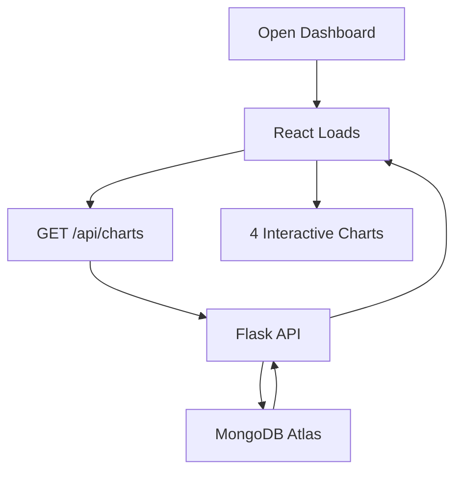

# 🌐Financial Dashboard Frontend


---

### Live Demo

**Frontend Live Demo**: [
https://financial-dashboard-project-eta.vercel.app/](
https://financial-dashboard-project-eta.vercel.app/) 

> **No login required** — Just open and explore!


### Overview

Interactive **React dashboard** with:

- **5 Plotly.js charts** (zoom, hover, export)
- **CCP, LTD, Debt Coverage, Liquid Assets**
- **Real data** from MongoDB Atlas
- **Public access** — no auth

---

## 📖 Table of Contents

- [🌐Financial Dashboard Frontend](#financial-dashboard-frontend)
    - [Live Demo](#live-demo)
    - [Overview](#overview)
  - [📖 Table of Contents](#-table-of-contents)
    - [🔗 Links](#-links)
  - [🎯 Purpose](#-purpose)
    - [🛠️ Tech Stack](#️-tech-stack)
    - [📂 Directory Structure](#-directory-structure)
    - [🚀 Setup Instructions](#-setup-instructions)
      - [Production (Vercel)](#production-vercel)
      - [🔄 How It Works](#-how-it-works)
    - [📸 Screenshots](#-screenshots)
      - [🤝 Contributing](#-contributing)
          - [Standards:](#standards)
    - [🔗 Links](#-links-1)
  

### 🔗 Links

- [Main README](../README.md)  
- [Backend README](../financial-backend/README.md)  
- [API Guide](../docs/api-guide.md)

## 🎯 Purpose

The frontend provides a user-friendly interface for financial teams to log in, fetch data from the Flask backend, and visualize metrics via interactive Plotly.js charts.

### 🛠️ Tech Stack

| Component       | Technology                     |
|-----------------|--------------------------------|
| **Frontend**    | React, Plotly.js, Axios        |
| **Environment** | Node.js (v16+)                 |
| **Deployment**    | Vercel (Free Tier)       |
| **API** | Flask on Render               |

### 📂 Directory Structure

```plaintext
frontend/
├── src/
│   ├── components/
│   │   ├── DashboardChart.js # Login and dashboard display
│   ├── App.js               # Main React component
├── public/
├── package.json             # Node.js dependencies
├── README.md                # This file
├── .env                     # Local API URL
```


### 🚀 Setup Instructions
```
Prerequisites
Node.js (v16+): Download
Backend running at http://localhost:5000 (see Backend README).

Steps

1. Navigate to frontend/:
cd finacial-dashboard
npm install

2. Install dependencies:
bash npm install

3. Create .env:
   REACT_APP_API_URL=http://localhost:5000

4. Start the app:
bash npm start
➡️ Runs at: http://localhost:3000

```

#### Production (Vercel)

```
Environment Variable (Set in Vercel Dashboard):
Key,Value
REACT_APP_API_URL,https://financial-dashboard-project-l853.onrender.com

Auto-deployed from GitHub

```

#### 🔄 How It Works
```
1. Login: Users authenticate via a React form, sending POST to /api/login, storing JWT in localStorage.
2. Data Fetch: Sends GET to /api/dashboard with Authorization: Bearer <token>.
3. Visualization: DashboardChart.js renders Plotly JSON as interactive charts.
```

Data Flow:


### 📸 Screenshots


**Dashboard** 

1. CCP & LTD by Company
   


2. Debt Coverage Ratio
   


3. Financial Resilience Heatmap
   


4. Debt vs Liquid Assets (all)
   


---

#### 🤝 Contributing
```
1. Fork: https://github.com/Patidarmadhuri/docs\screenshots\Frontend\Financial_Dashbord_Screenshot.pngFinancial-Dashboard-Project

2. Create branch:
bash git checkout -b feature/frontend-your-feature

1. Commit and push:
bash git commit -m "Add frontend feature"
git push origin feature/frontend-your-feature

1. Open a Pull Request.
```

###### Standards:
```
Code Style: ESLint for React
Issues: Use GitHub Issues
Screenshots: Add to ../docs/screenshots/
```

🔗 Main README | API Guide

### 🔗 Links

- [Main README](../README.md)  
- [Backend README](../financial-backend/README.md)  
- [API Guide](../docs/api-guide.md)